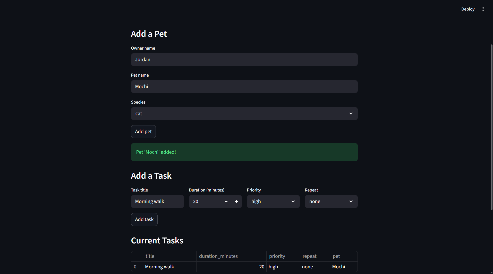
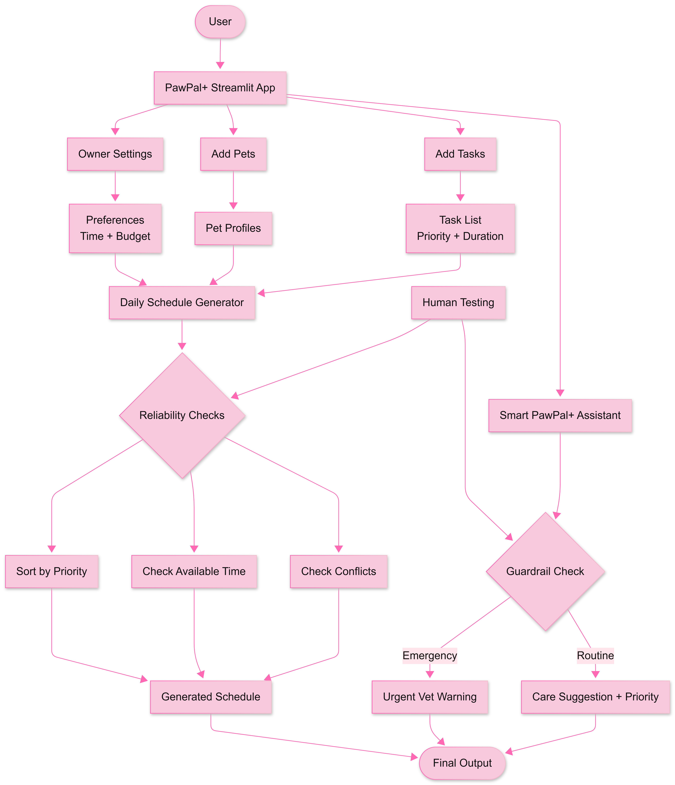

# PawPal+ Intelligent Pet Care Assistant

A Streamlit-based pet care management app enhanced with AI-powered natural language assistance, emergency guardrails, and smart daily scheduling.

---

## Original Base Project

PawPal+ began as a Module 2 project focused on helping pet owners plan and track daily care tasks. The original app introduced the core data model — `Owner`, `Pet`, `Task`, and `Scheduler` — and demonstrated priority-based scheduling, conflict detection, and recurring task support through a simple Streamlit interface. It established the foundation that the final project builds directly on top of.

---

## Final Project Summary

For the final project, PawPal+ was upgraded from a basic task tracker into an intelligent pet care assistant. New capabilities include a personalized owner settings panel, multi-pet management (with name, species, age, and gender), a rich task model with categories and cost tracking, a smart daily schedule generator, and a natural language assistant that classifies pet-care questions, delivers category-specific recommendations, and surfaces emergency warnings when dangerous keywords are detected.

The result is a single-page Streamlit app that takes a pet owner from initial setup through daily schedule generation — checking both available time and daily budget — with a conversational AI layer available at any step.



---

## Why This Project Matters

Pet care is easy to deprioritize when life gets busy. A busy owner managing multiple pets, variable schedules, and a limited budget needs a tool that does more than store a list — it needs to reason about constraints and flag problems before they become emergencies.

PawPal+ demonstrates how a small, well-structured Python application can deliver real value: it respects the owner's available time, surfaces scheduling conflicts, and acts as a safety net by steering users toward a veterinarian when their input suggests a medical crisis.

---

## Key Features

| Feature | Description |
|---|---|
| **Owner Settings Sidebar** | Set first name, last name, available minutes per day, and max daily budget. Persists across the session. |
| **Multi-Pet Management** | Add unlimited pets with name, species, age, and gender. Duplicate names are blocked. |
| **Your Pets Dashboard** | Select any pet from a dropdown to view only that pet's tasks. Each row shows category, scheduled time, duration, priority, repeat, and cost. Remove tasks with one click. |
| **Task Management** | Add tasks with name, category (feeding / exercise / grooming / medication / vet / enrichment / other), priority, scheduled time (hour, minute, AM/PM), duration, cost, and repeat frequency. Tasks are always assigned to the currently selected pet. |
| **Generate Daily Schedule** | Sorts all tasks by priority. Checks total scheduled minutes against available minutes/day and total estimated cost against the daily budget. Shows warnings if either limit is exceeded and runs conflict detection per pet. |
| **Smart PawPal+ Assistant** | Accepts free-text pet-care questions. Classifies input into feeding, grooming, exercise, scheduling, or general care, then returns a targeted tip and suggested task. |
| **Emergency Guardrails** | Detects keywords like *chocolate*, *poison*, *seizure*, and *bleeding* and immediately displays a high-visibility warning with ASPCA Poison Control contact information. |

---

## Architecture Overview

```
pawpal-ai-final/
├── app.py                  # Streamlit UI — all sections and user interactions
├── pawpal_system.py        # Core logic: Owner, Pet, Task, Scheduler classes
├── tests/
│   └── test_pawpal.py      # pytest test suite
├── assets/
│   ├── pawpal_system_diagram_final.png
│   └── pawpal_demo.png
└── requirements.txt
```

**System diagram:**

<a href="assets/pawpal_system_diagram_final.png" target="_blank">
  
</a>

### Data flow

1. The user configures owner settings in the sidebar → stored in `st.session_state`.
2. Pets are added to `st.session_state.owner` (an `Owner` object backed by a `Scheduler`). Age and gender are stored separately in `st.session_state.pet_details` because the `Pet` dataclass only holds name and type.
3. Tasks are added to both `st.session_state.tasks` (a list of display dicts with category, time, cost, and other UI fields) and to the `Pet` object via `owner.schedule_task()`.
4. The schedule generator reads from `st.session_state.tasks`, sorts by priority, compares total minutes against `available_minutes`, compares total cost against `daily_budget`, and calls `scheduler.detect_conflicts()` per pet.
5. The assistant reads the raw text input, runs keyword classification, and returns a response — no external API calls required.

### Key classes (`pawpal_system.py`)

- **`Task`** — holds title, time, priority, duration, frequency, and status. Supports recurring task generation on completion.
- **`Pet`** — stores a name, species, and list of `Task` objects.
- **`Owner`** — holds owner name, a list of pets, and a reference to the shared `Scheduler`.
- **`Scheduler`** — provides `sort_by_time()`, `filter_tasks()`, `detect_conflicts()`, and `get_conflict_pairs()`.

---

## Setup Instructions

**Prerequisites:** Python 3.9 or higher.

```bash
# 1. Clone the repository
git clone https://github.com/SumaiyaAhona/pawpal-applied-ai-system.git
cd pawpal-ai-final

# 2. Create and activate a virtual environment
python -m venv .venv
source .venv/bin/activate        # macOS / Linux
# .venv\Scripts\activate         # Windows

# 3. Install dependencies
pip install -r requirements.txt
```

---

## How to Run the App

```bash
streamlit run app.py
```

The app opens at `http://localhost:8501` in your browser.

To run the test suite:

```bash
pytest tests/ -v
```

---

## Sample Interactions

### 1. Daily schedule fits within available time and budget

> Owner sets available minutes to **90** and daily budget to **$15.00**. Three tasks added for Mochi (dog, 3 yr, female): Morning Walk (exercise, 8:00 AM, 30 min, high, $0.00), Evening Feeding (feeding, 6:00 PM, 15 min, medium, $3.50), Weekly Brushing (grooming, 10:00 AM, 20 min, low, $0.00).

**Output:**
```
⏱ Schedule fits! Total: 65 min of your 90 min available.
💰 Total cost $3.50 is within your daily budget of $15.00.

Today's Schedule (high priority first)
| Pet   | Task            | Category  | Time     | Duration (min) | Priority | Repeat | Cost  |
|-------|-----------------|-----------|----------|----------------|----------|--------|-------|
| Mochi | Morning Walk    | exercise  | 8:00 AM  | 30             | high     | daily  | $0.00 |
| Mochi | Evening Feeding | feeding   | 6:00 PM  | 15             | medium   | daily  | $3.50 |
| Mochi | Weekly Brushing | grooming  | 10:00 AM | 20             | low      | weekly | $0.00 |
```

---

### 2. Schedule exceeds available time and daily budget

> Owner has **45 minutes** available and a **$5.00** budget. Same three tasks total **65 minutes** and **$3.50**, plus a vet appointment (vet, 60 min, high, $75.00).

**Output:**
```
⏱ Total task time is 125 min but you only have 45 min/day available.
  Consider removing or shortening some tasks.

Total estimated daily cost: $78.50
💰 Total cost $78.50 exceeds your daily budget of $5.00.
```

---

### 3. Emergency keyword detected in the assistant

> User types: *"My dog ate some chocolate, what should I do?"*

**Output:**
```
🚨 Emergency detected!

Your message contains keywords that may indicate a medical emergency.
Contact your veterinarian or an emergency animal clinic immediately.

You can also call the ASPCA Animal Poison Control Center: 1-888-426-4435
```

---

## Design Decisions and Trade-offs

**Rule-based AI over an external LLM**
The assistant uses keyword matching rather than an API call to a large language model. This keeps the app self-contained, free to run, and easy to explain in a presentation. The trade-off is that phrasing variations can slip past detection — a limitation acknowledged as a future improvement.

**`st.session_state` as the single source of truth for the UI**
Task data is stored in both the `Pet` objects (for the `Scheduler`) and in `st.session_state.tasks` (for display). The display dict carries extra fields — category, scheduled time, cost — that the `Task` dataclass does not model. This duplication simplifies the UI at the cost of keeping two structures in sync. For a production app, a single data store with a query layer would be preferable.

**Pet metadata split across two stores**
The `Pet` dataclass only holds name and type, so age and gender are stored separately in `st.session_state.pet_details`. This avoids modifying the underlying class while still surfacing the data in the UI. The trade-off is one more state key to keep consistent.

**Flat task list instead of a database**
All tasks live in memory for the duration of the session. This is appropriate for a demo and keeps the stack simple (no database dependency), but means data is lost on page refresh.

**Emergency guardrails as the first classification check**
The assistant always checks for emergency keywords before any category classification. This ordering ensures safety-critical responses are never overridden by a more specific but less urgent category match.

---

## Testing Summary

The test suite covers the core scheduling logic in `pawpal_system.py`:

| Area | What is tested |
|---|---|
| Sorting | Tasks returned in correct time order; single-pet scoping works |
| Recurring tasks | Daily and weekly offsets produce correct next dates; non-recurring returns `None`; new task starts as `"pending"` |
| Conflict detection | Overlapping tasks are flagged; `get_conflict_pairs()` returns correct tuples; no cross-pet false positives |
| Edge cases | Empty pet lists and unregistered pets return `[]` without raising exceptions |

Run with:

```bash
pytest tests/ -v
```

---

## Reflection

The biggest technical challenge was keeping the `Scheduler` object and `st.session_state.tasks` in sync after tasks are removed through the UI. Solving this required tracking the original list index through the filter so the remove button always deletes the correct entry.

Expanding the task model to include category, scheduled time, and cost introduced a second sync challenge: the `Task` dataclass used by the `Scheduler` does not store those fields, so they live only in the display dict. Writing the schedule generator to read from the display dict (rather than the `Task` objects) kept the code simple but made the split more explicit.

The most valuable design lesson was the importance of classifying input *before* displaying anything. Adding the emergency check as the first branch of the classifier — rather than an afterthought — made the guardrail reliable and easy to reason about.

If I were starting over, I would use a single canonical task store (even a simple JSON file) instead of parallel data structures, and I would extend the `Task` dataclass to hold category and cost directly. That would eliminate the sync problem and make the data model self-documenting.

---

## Future Improvements

- **Persistent storage** — save pets, tasks, and owner settings to a local JSON file or SQLite database so data survives a page refresh.
- **LLM integration** — replace keyword matching with a Claude or GPT API call for richer, more flexible natural language understanding, especially for inputs that don't match the current keyword lists.
- **Task editing** — allow the owner to update an existing task's title, category, time, or cost in place rather than removing and re-adding it.
- **Unified data model** — extend the `Task` dataclass to store category and cost natively, eliminating the need for parallel data structures.
- **Mobile-friendly layout** — adjust column widths and font sizes so the app is usable on a phone.
- **Vet locator** — when an emergency is detected, surface a link to the nearest emergency vet using the owner's zip code.
- **Per-pet cost summary** — break down the daily cost estimate by pet so owners can see which animal's care is driving budget usage.

---

## Loom Demo

[Watch the demo walkthrough](https://www.loom.com/share/c3ae27b2cc0c465a99d99b5000e78ffe) ← 

---

## Portfolio Statement

PawPal+ demonstrates my ability to design a multi-class Python system from a UML diagram, implement it with test coverage, and surface it through a polished Streamlit interface. The final project extends the original scope with multi-pet management, a rich task model (category, scheduled time, cost), dual constraint checking (time and budget), a rule-based AI classifier, and safety guardrails — showing that I can ship features responsibly, not just functionally.

Built with **Python** and **Streamlit**.

---

*PawPal+ — CodePath Final Project*

## Portfolio Reflection

This project reflects my growth as an AI engineer by showing that I can improve an existing system into a more intelligent, user-centered product. I combined software engineering, interface design, scheduling logic, and responsible AI features such as guardrails and reliability testing. It also demonstrates that I value practical solutions that are clear, useful, and safe for real users.